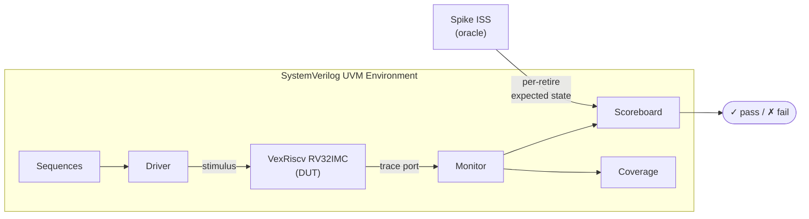

# DOOMtang

**Verifying a RISC-V softcore and running DOOM on an FPGA — step by step.**
A **SystemVerilog UVM** environment verifies a **VexRiscv RV32IMC** core by
lockstep comparison against **Spike** (the industry-standard RISC-V ISS), then
the verified SoC — built with **LiteX** — runs the original *DOOM* on a
**Sipeed Tang 20k Primer (Gowin GW2A-18)** FPGA.

---

## Why this project

CPUs aren't verified by eyeballing waveforms — they're verified by **step-and-compare
against a golden reference** (cf. Google's `riscv-dv` + Spike co-simulation). DOOMtang
is my own version of that loop, built up in three public steps:



See **[docs/ARCHITECTURE.md](docs/ARCHITECTURE.md)** for the full methodology.

## Roadmap & status

| Step | Deliverable | Skills | Status |
|-----:|-------------|--------|--------|
| 1 | SV-UVM env verifying `MiniAlu` ALU ops + LED demo on Tang 20k | UVM, SV, RTL | 🟡 in progress |
| 2 | Memory-mapped MiniAlu + SD / HyperRAM / HDMI / USB on Tang 20k | RTL, arch, peripherals | ⬜ next |
| 3 | LiteX SoC + VexRiscv + UVM lockstep vs Spike → **DOOM** on Tang 20k | UVM, RISC-V, FPGA | ⬜ |

Full detail and design decisions: **[docs/ROADMAP.md](docs/ROADMAP.md)**.

## Design choices

- **ISA: RV32IMC** — handled by VexRiscv; enough to run DOOM at usable speed. ([docs/isa.md](docs/isa.md))
- **Spike as the oracle** — the RISC-V Foundation's reference simulator; battle-tested,
  no need to hand-write a parallel ISS. VexRiscv's trace port feeds the UVM monitor for
  per-retire step-and-compare.
- **VexRiscv + LiteX for Step 3** — LiteX has Tang 20k board support, VexRiscv
  integration, LiteSDCard, LiteVideo (HDMI framebuffer + DMA), and a HyperRAM
  controller. DOOM port via `doomgeneric` + FatFS on SD.
- **UVM env grows with the project** — the Step-1 env (MiniAlu) is extended, not
  rewritten, into the Step-3 lockstep env. Same components, new DUT + reference.

## Repository layout

```
DOOMtang/
├── shell.nix            # reproducible OSS toolchain (nix-shell)
├── docs/                # ARCHITECTURE, ROADMAP, isa, Beamer slides
├── tb/                  # SystemVerilog UVM environment  (Step 1 → 3)
├── dut/                 # DUTs under verification (MiniAlu, then VexRiscv)
├── sim/                 # Makefiles, filelists, run scripts, transcripts
└── fpga/                # Tang 20k constraints + LiteX SoC + bitstream flow
```

## Getting started

```bash
nix-shell            # Verilator, Icarus, Yosys/nextpnr/apicula,
                     # riscv32 gcc, spike, gtkwave — all pinned
cd sim && make       # (Step 1) open-source smoke test
```

The full SystemVerilog UVM environment in `tb/` needs a commercial-grade simulator;
run it free on **EDA Playground** (Questa/VCS) or **Questa Intel FPGA Starter Edition**.
The open-source `shell.nix` flow covers RTL, the FPGA bitstream, and everything else.

---

*Author: Isaac Gómez Sánchez · Target board: Sipeed Tang 20k Primer (Gowin GW2A-18).*
